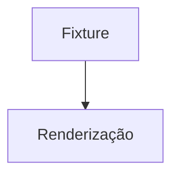

# Fixture de compatibilidade Obsidian

Esta nota é uma fixture técnica não científica. Ela não faz parte do vault nem deve ser publicada no Atlas.

## Wikilinks e aliases

- [[Fixture alvo]]
- [[Fixture alvo|rótulo alternativo]]
- [[Conceito ausente da fixture]]
- [Página externa](https://example.com)

## Callout, destaque e lista de tarefas

> [!note] Callout de teste
> O conteúdo deste callout existe apenas para verificar a renderização do formato.

Texto com ==destaque== e uma lista operacional:

- [ ] tarefa pendente
- [x] tarefa concluída

## Tabela e código

| Campo | Valor |
| --- | --- |
| formato | Obsidian Flavored Markdown |
| escopo | fixture técnica |

```ts
const fixtureKind = "compatibility";
console.log(fixtureKind);
```

## Matemática e Mermaid

$$
E = mc^2
$$



## Imagem, embed, transclusão e referência de bloco


![[fixture.svg]]

![[Fixture alvo]]

![[Fixture alvo#^bloco-qa]]

## Footnote e âncora

Uma afirmação técnica com nota de rodapé.[^1]

[^1]: Nota de rodapé da fixture.

O título desta seção deve produzir uma âncora navegável.
